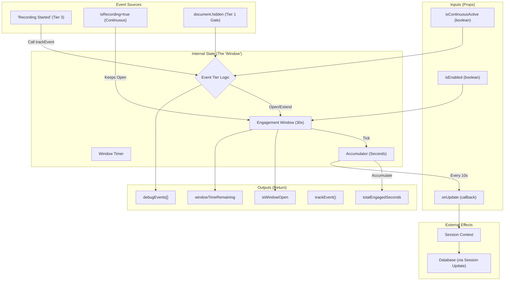

# Engagement Tracker Flow Analysis

## Overview
The `useEngagementTracker` hook manages user engagement "sessions" by treating engagement as a time-window that must be kept open by user actions. It acts as the central logic for tracking `engagedTimeSeconds`.

## Data Flow Diagram

## detailed Mapping

### 1. Inputs (Going In)
Code entering `useEngagementTracker(props)`:

| Prop | Source in `ActiveQuestionScreen` | Purpose |
| :--- | :--- | :--- |
| **`isEnabled`** | `session.status !== 'COMPLETED'` | Prevents tracking on finished sessions. |
| **`isContinuousActive`** | `isRecording` (from `useAudioRecording`) | **Primary Driver.** Keeps the engagement window open indefinitely while the user is recording audio. |
| **`onUpdate`** | Anonymous Function Wrapper | Receives `seconds` (delta) and calls `updateSession` to persist data to the `SessionContext` (and ultimately the DB). |

### 2. Internal Logic (The "Black Box")
The hook processes engagement via a "Tiered" system:

*   **Tier 1 (Presence):**
    *   **Logic:** Checks `document.hidden` every second.
    *   **Effect:** If hidden, immediately forces window close and stops tracking, regardless of other states.
*   **Tier 2 (Interaction):**
    *   **Trigger:** `trackEvent('tier2', ...)`
    *   **Logic:** *Only* extends the window if it is **already open**. Does not start a new session.
    *   **Current Usage:** **None found** in `ActiveQuestionScreen`.
*   **Tier 3 (Task Event):**
    *   **Trigger:** `trackEvent('tier3', ...)`
    *   **Logic:** explicitly **opens** the window (starts tracking) and sets expiry to +30s.
    *   **Current Usage:** Triggered when the user clicks the Microphone button (`handleToggleRecording`).
*   **Continuous (Virtual Tier 3):**
    *   **Logic:** While `isContinuousActive` is `true`, the window is forced open and expiry is constantly pushed forward.

### 3. Outputs (Coming Out)
Data returned by the hook for consumption:

| Output | Consumed By | Usage |
| :--- | :--- | :--- |
| **`trackEvent`** | `ActiveQuestionScreen` | Used in `handleToggleRecording` to signal "Recording Started". |
| **`totalEngagedSeconds`** | `EngagementDebugOverlay` | Visual display of total time this session. |
| **`isWindowOpen`** | `EngagementDebugOverlay` | Shows "ACTIVE" vs "IDLE" status. |
| **`windowTimeRemaining`** | `EngagementDebugOverlay` | Shows countdown timer until idle. |
| **`debugEvents`** | `EngagementDebugOverlay` | List of recent internal events for debugging. |

### 4. Side Effects (Persisting Data)
*   **Auto-Save:** Every 10 seconds (if engagement accrued), the `onUpdate` callback is fired.
*   **Unmount Flush:** When the component unmounts, any remaining unsaved seconds are flushed via `onUpdate`.

## Architecture Observations

1.  **Audio-Centric Tracking:**
    Currently, engagement is heavily biased towards the **Voice** mode.
    *   **Voice Mode:** Tracking is robust because `isRecording` keeps the window open ("Continuous" mode).
    *   **Text Mode:** There appears to be **no active tracking sources** for Text Mode. The `textarea` and `handleTextSubmit` do not call `trackEvent`. A user writing a long answer without recording might register as "Idle" (0 engagement) unless they interact with a Tier 3 element.

2.  **Opt-In Model:**
    The tracker does not automatically listen to global mouse/keyboard events. All engagement signals must be manually wired up via `trackEvent`.
